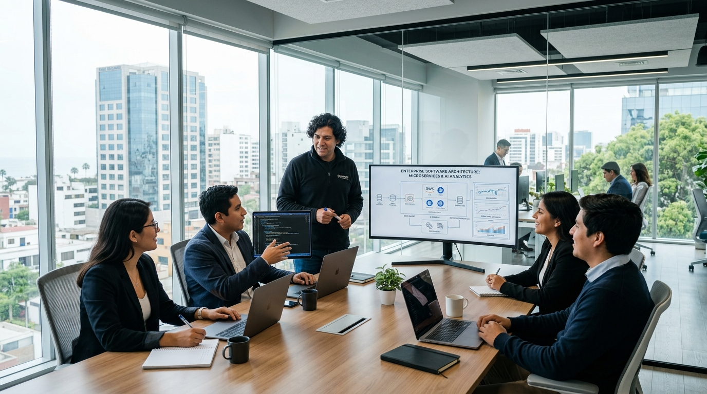

# Integrity Software S.A.C. 🚀
> **Plataforma Corporativa de Desarrollo de Software, Automatización MYPE & Bots de WhatsApp en Perú**  
> **RUC:** 20609874125 | **Empresa Formal S.A.C.** | **Sede:** Lima, Perú

[](https://nextjs.org/)
[](https://www.typescriptlang.org/)
[](https://react.dev/)
[](https://nextjs.org/docs/app/building-your-application/optimizing/turbopack)



---

## 📌 Visión General del Proyecto

**Integrity Software** es el portal corporativo y plataforma de servicios tecnológicos de **INTEGRITY SOFTWARE S.A.C.**, empresa peruana especializada en el desarrollo de software a medida, sistemas ERP/CRM, automatizaciones SUNAT y bots inteligentes de WhatsApp para Micro y Pequeñas Empresas (MYPES).

La plataforma cuenta con una **arquitectura modular de alto nivel**, construida 100% en **TypeScript 7**, impulsada por **Next.js 16** y la biblioteca **React 19**, garantizando velocidad ultrarrápida (Turbopack Engine), renderizado estático optimizado (SSG), cero deuda técnica y mantenibilidad profesional.

---

## 🛠️ Stack Tecnológico & Arquitectura

| Capa | Tecnología | Descripción |
| :--- | :--- | :--- |
| **Lenguaje Core** | `TypeScript 7.0` | Tipado estático estricto, interfaces desacopladas y cero `any`. |
| **Framework Web** | `Next.js 16` | App Router, soporte para TypeScript 7 CLI y compilación Turbopack. |
| **UI Library** | `React 19` | Arquitectura basada en componentes reactivos y hooks personalizados. |
| **Estilos & UI** | `Vanilla CSS3` | Tokens de diseño, Glassmorphism, 3D Tilt Effects, Flexbox/Grid y Parallax. |
| **Tipografías** | `Google Fonts` | *Inter* & *Plus Jakarta Sans* |
| **Iconografía** | `FontAwesome 6` | Iconos vectoriales corporativos |

---

## 🏗️ Estructura del Proyecto (Arquitectura Modular)

El proyecto sigue el patrón de diseño **Desacoplamiento de Componentes y Datos** (*Data-UI Separation Pattern*):

```
IntegritySoftware/
├── app/
│   ├── globals.css           # Sistema de diseño, tokens CSS y variables globales
│   ├── layout.tsx            # Root Layout (SEO Metadata, Fuentes y HTML Head)
│   └── page.tsx              # Página principal (Composición modular de 25 líneas)
├── components/               # Componentes UI encapsulados e independientes
│   ├── TopNoticeBar.tsx      # Barra superior con RUC y Razón Social formal
│   ├── Navbar.tsx            # Navegación principal y menú drawer móvil
│   ├── HeroSection.tsx       # Hero interactivo, máquina de escribir y slider
│   ├── BenefitsGrid.tsx      # Tarjetas de beneficios MYPE con efecto 3D tilt
│   ├── ServicesCarousel.tsx  # Carrusel horizontal de servicios MYPE
│   ├── TestimonialsCarousel.tsx # Carrusel de testimonios reales en Perú
│   ├── DeliverablesTabs.tsx  # Pestañas de entregables con indicador animado
│   ├── TrustBanner.tsx       # Banner de medios de pago locales (Yape/Plin/BCP)
│   ├── ContactSection.tsx    # Formulario de cotización conectado a WhatsApp
│   ├── Footer.tsx            # Pie de página corporativo
│   └── WhatsAppFloat.tsx     # Botón flotante animado de atención 24/7
├── data/                     # Capa de contenidos desacoplada (Sin código visual)
│   ├── hero.ts               # Frases de máquina de escribir y diapositivas
│   ├── benefits.ts           # Tarjetas de beneficios clave
│   ├── services.ts           # Lista de 5 servicios MYPE especializados
│   ├── testimonials.ts       # Casos de éxito y calificaciones
│   └── deliverables.ts       # Entregables detallados por servicio
├── types/                    # Interfaces estricta de TypeScript
│   └── index.ts              # Tipos globales (ServiceItem, TestimonialItem, etc.)
├── public/                   # Recursos estáticos y multimedia
│   └── img/                  # Fotografías y banners de alta resolución
├── next.config.ts            # Configuración de Next.js (TypeScript 7 CLI)
├── tsconfig.json             # Configuración del compilador TypeScript 7
├── README.md                 # Documentación técnica corporativa
└── ARCHITECTURE.md           # Guía técnica de arquitectura de software
```

---

## 💼 Portafolio de Servicios MYPE

1. **Landing Page + Bot de WhatsApp 24/7:**
   - Captación automática de clientes desde Google/Facebook Ads y respuestas inteligentes 24/7.
2. **Catálogo Digital & Tienda Virtual:**
   - Carrito de compras con integración de pasarelas de pago peruanas (**Yape**, **Plin**, **Culqi**, Mercado Pago).
3. **Sistema ERP / CRM MYPE a Medida:**
   - Control de inventario, ventas, clientes e historial de caja accesible desde smartphone o PC.
4. **Conexión SUNAT & APIs:**
   - Emisión directa de comprobantes electrónicos (Boletas / Facturas) e integración de reportes de caja por WhatsApp.
5. **Mantenimiento & Soporte Técnico Mensual:**
   - Administración de servidores cloud, copias de seguridad continuas y soporte prioritario.

---

## 🚀 Guía de Instalación y Despliegue

### Requisitos Previos
- **Node.js**: v18.17.0 o superior
- **npm**: v9.0.0 o superior

### Entorno de Desarrollo

1. **Clonar el repositorio:**
   ```bash
   git clone https://github.com/MartinMaldo592/IntegritySoftware.git
   cd IntegritySoftware
   ```

2. **Instalar dependencias:**
   ```bash
   npm install
   ```

3. **Iniciar el servidor de desarrollo:**
   ```bash
   npm run dev
   ```
   Accede a `http://localhost:3005` en tu navegador.

### Compilación para Producción (TypeScript Check & SSG)

Para generar la compilación optimizada con Next.js 16 y TypeScript 7:
```bash
npm run build
```

Para ejecutar el servidor de producción localmente:
```bash
npm run start
```

---

## 🏢 Información Corporativa & Legal

- **Razón Social:** INTEGRITY SOFTWARE S.A.C.
- **RUC:** 20609874125
- **Domicilio:** Lima, Perú
- **Correo Corporativo:** contacto@integritysoftware.pe
- **WhatsApp:** +51 900 000 000

---

© 2026 **INTEGRITY SOFTWARE S.A.C.** Todos los derechos reservados.
